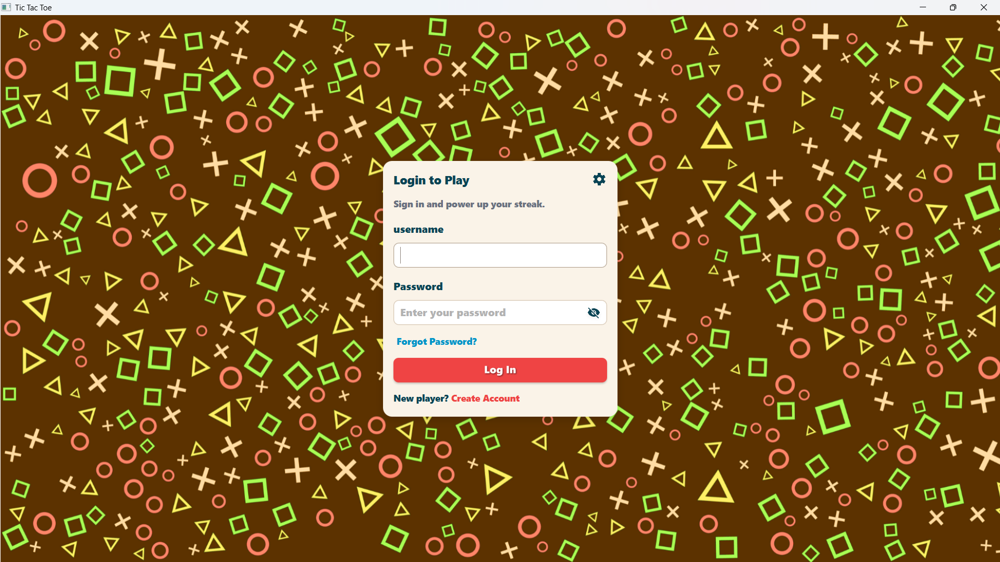
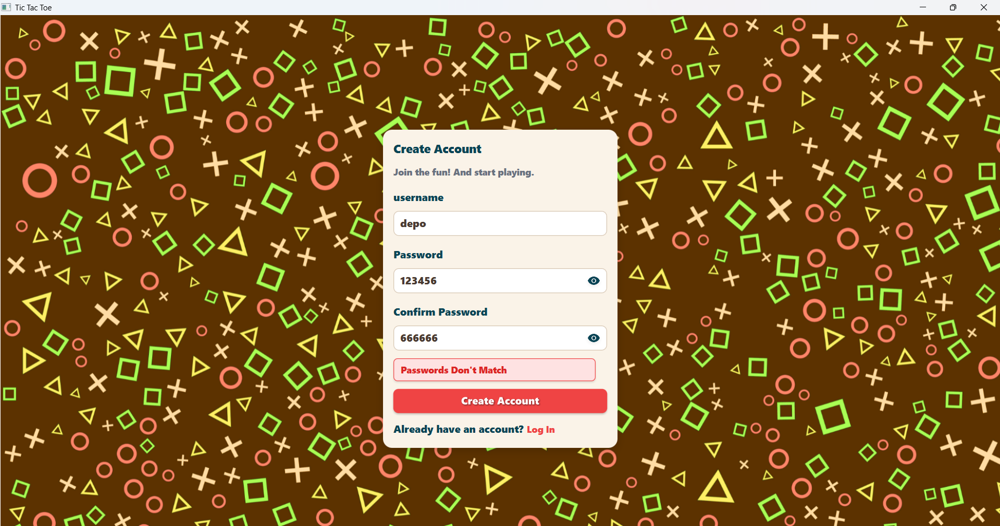
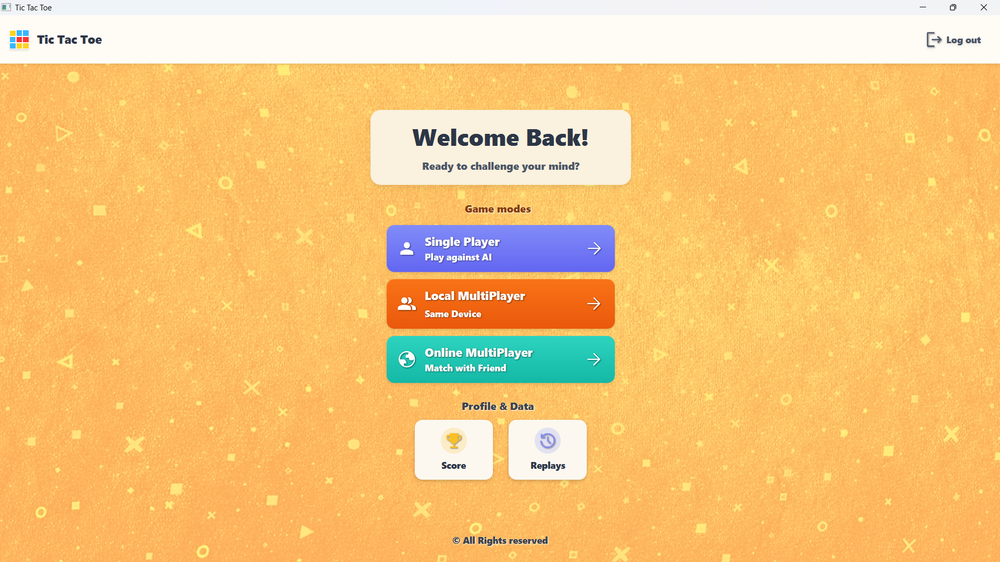
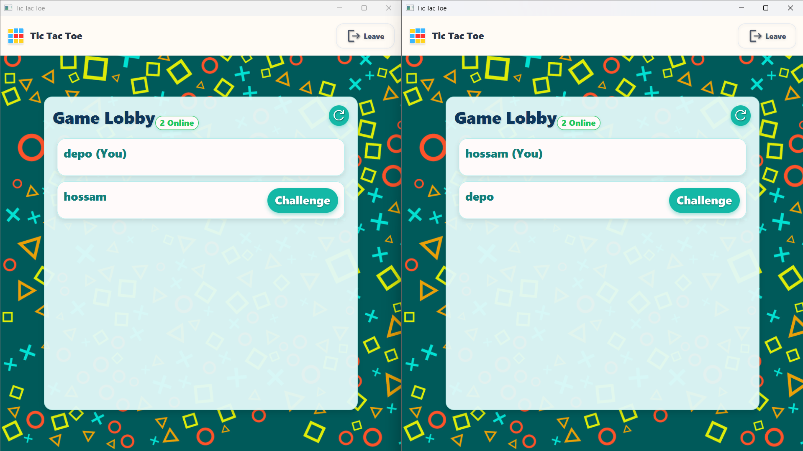
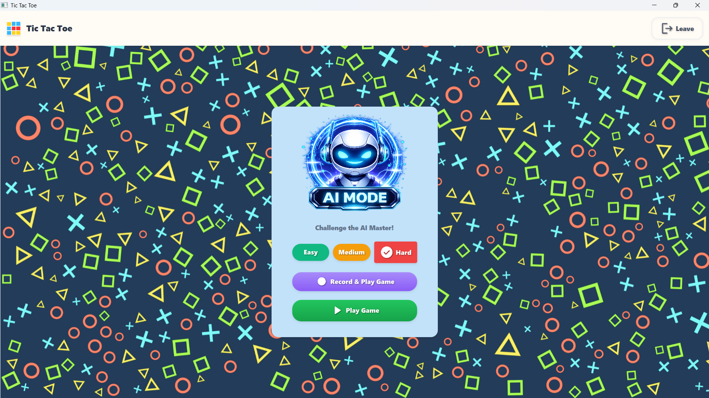
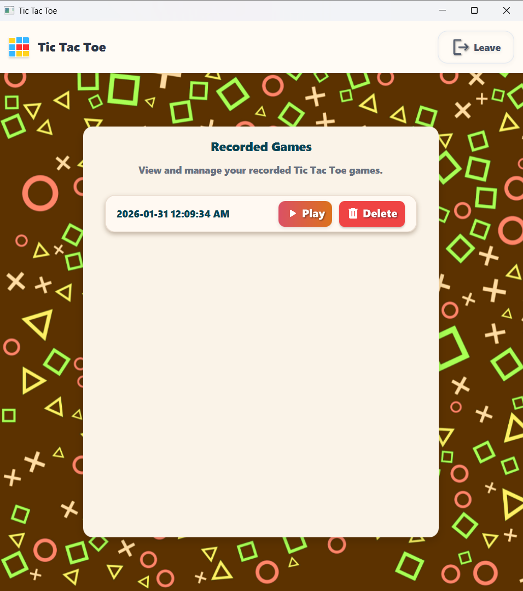

# XOClient
## Description

XOClient is a multiplayer Tic-Tac-Toe (XO) game that allows players to compete with friends either on the same device or across different devices on the same local network.  
The game also offers a mode where players can challenge an NPC with multiple difficulty levels.

XOClient focuses on delivering a smooth, enjoyable, and interactive gaming experience with support for saving and replaying matches.

## Features

- Play with friends on the same device
- Play with friends over the local network
- Challenge an NPC with multiple difficulty levels
- Responsive design for different screen sizes
- Save and replay previous games
- Simple and intuitive user interface
- Fun end-game experience after each match
## Tech Stack
creating that application wasn't an easy task actually we used:
- Sockets To Connect With Server 
- Gson to handle ongoing/outgoing messages
- Executers to handle threading
- Custom CallBack system to handle events after recieving response
- Min Max impelentation for Playing against NPC
- Files I/O to save games
- Custom Encryption Algorithm to save game files and be sure it's not modified
## How To Play?
1. find the jar files at: [drive link](https://drive.google.com/file/d/1gzLI4Gr8XZFlbZ5u0e3CEHmg3McKPif7/view?usp=drive_link)
2. to run them properly you should have a java jdk with javafx installed on it and I recommend [Azul Version](https://www.azul.com/downloads/?package=jdk-fx#zulu) or using javafx sdk type that command  
```bat
java --module-path "C:\javafx-sdk-23.0.1\lib" --add-modules javafx.controls,javafx.fxml,javafx.media -jar clientside-1.0-SNAPSHOT.jar
```
3. don't forget to run the server find instructions at: [XO Server](https://github.com/iTi-XO-Game/XOServer)
4. and have fun while playing :)

## Screenshots
### Authentication & Home
<p align="center">
  
  
  
</p>

---

### Game Modes
<p align="center">
  
  
</p>

---

### Gameplay
<p align="center">
  
  
</p>

---

### Replays
<p align="center">
  
</p>
