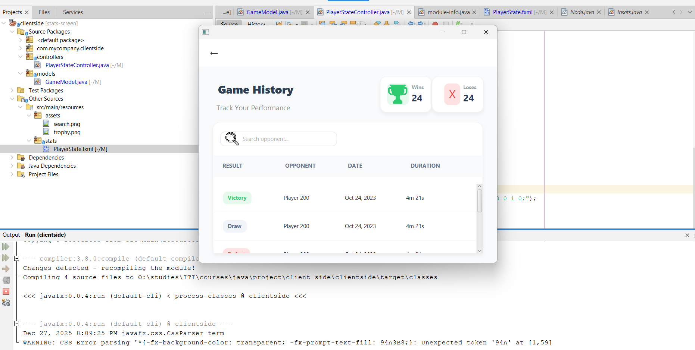
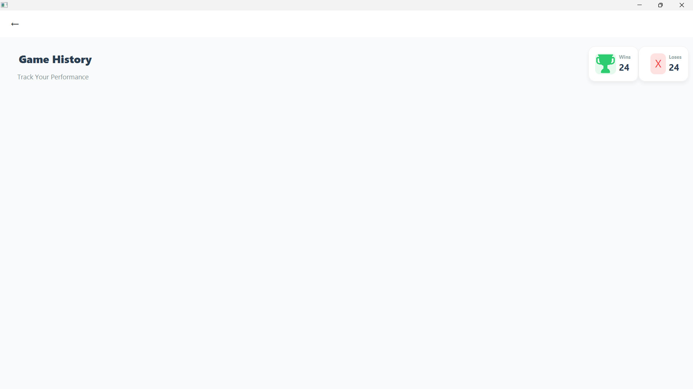

# XO Client 
## explaining the architecture
### we are using MVC - model,view,controller
- the model contains the actual data representation that will be stored on the database and is coming to us from the databae
- the view is our UI
- the controllers is the place where we link between the model and the view   it's the place where we can handle the user clicks on our UI 
### helpers?
- you may have noticed that helper package and wondering why, it's just mvc, just three packages 
- but, if you will do the same task multiple times, how to do that on a **clean way**?
- that's where the helpers comes to the action, you don't need to write the code all the times to navigate, you don't need to specify the path each time you want to call an fxml
- just write your code, one time in one place and use it wherever you want
- and when maintaining, you are just changing code on one place!
## screenshots

